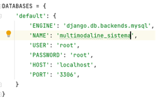
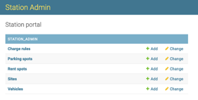
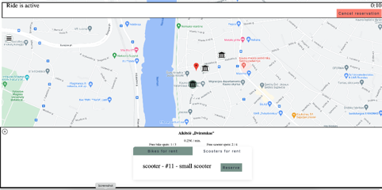

# Running the application
System requirements:
1. `Python 3.10`
2. `MySQL 10.6`
3. `Crontab` (optional)

To run the project:
1. Install required packages:  
`python -m pip install -r requirements.txt`
2. Setup database configuration by changing credentials in settings.py:  

3. Prepare database by running migrations:  
`python manage.py migrate`
4. Run the server:  
`python manage.py runserver`

You should be able to access the system by going to: `http://127.0.0.1:8000`

# Admin
To access the admin panel go to: `http://127.0.0.1:8000/admin`
You can create admin user by running this command:  
`python manage.py createsuperuser`  
In the admin you can set up sites, create vehicles, parking spots etc...

# Client
To access client part of the system go to: `http://127.0.0.1:8000/station/`
If you go to rent or park map you will see different sites in which user can park or rent a vehicle.

